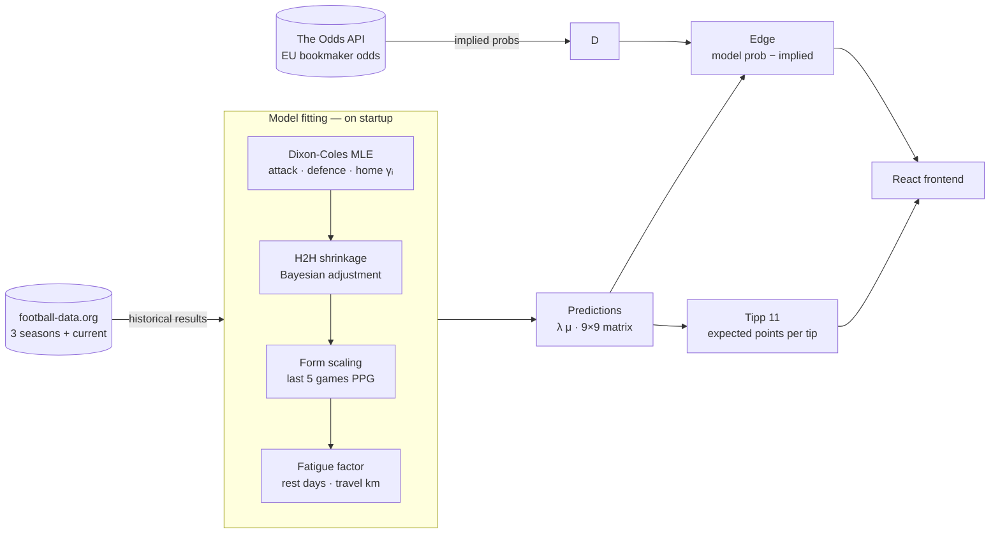
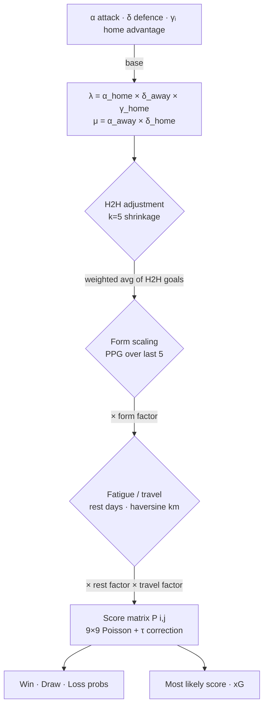

# Bundesliga Predictor

> A full-stack Bundesliga match prediction app built on the **Dixon-Coles Poisson model** — with bookmaker edge analysis, Tipp 11 optimisation, and model calibration tracking.


---

## What it does

The app pulls three seasons of Bundesliga results, fits a Bayesian football model on startup, and serves live predictions for every fixture in the current Rückrunde. Predictions are compared against bookmaker odds to identify edges, and the full 9×9 score-probability matrix is used to recommend the optimal Tipp 11 tip for each game.

---

## Data & prediction pipeline



---

## Model adjustments

Each prediction starts from a base Dixon-Coles estimate and passes through four optional adjustment layers:



---

## Features at a glance

| Area | What you get |
|------|-------------|
| **Predictions** | 9×9 score probability heatmap, win/draw/loss bars, xG, most likely score |
| **Model enhancements** | Per-team home advantage, H2H Bayesian shrinkage, form scaling, fatigue/travel |
| **Bookmaker comparison** | Live EU odds, implied probability normalisation, edge per outcome |
| **Blended model** | Toggle 50/50 Dixon-Coles + bookmaker blend affecting all heatmaps and tips |
| **Tipp 11** | Expected points per possible tip; round summary with actual vs expected |
| **League table** | Live standings + model-implied expected points for remaining fixtures |
| **Accuracy tracker** | Tendency accuracy, exact score rate, edge pick accuracy vs naive baseline |
| **Calibration** | Brier score, log-loss, calibration curve, Spieltag chart, ablation comparison |
| **Navigation** | Full Rückrunde (Spieltag 18–34), live filter, team filter with favourite |

---

## App layout

```
┌─────────────────────────────────────────────────────────────────┐
│                     Header  (banner + crests)                   │
├──────────────────────────────────────────────────────────────────┤
│  Spieltag  │  Live  │  Tipp 11  │  + Odds  │  Table  │  Calib  │  ← filter bar (sticky)
├────────────┬─────────────────────────────────────────────────────┤
│            │  Accuracy summary  (finished matchdays only)        │
│  Sidebar   │  Tipp 11 round summary  (when Tipp 11 active)       │
│  matchup   ├─────────────────────────────────────────────────────┤
│  list      │  Fixture card × 9                                   │
│  + best    │  ┌───────────────────────────────────────────────┐  │
│  Tipp 11   │  │  Teams · score/xG · rest days · travel km    │  │
│  tip       │  │  Win/draw/loss bars                           │  │
│            │  │  Score heatmap  │  Tipp 11 heatmap (toggle)  │  │
│            │  │  Odds comparison + edge                        │  │
│            │  └───────────────────────────────────────────────┘  │
└────────────┴─────────────────────────────────────────────────────┘
```

---

## Getting started

### Prerequisites

- Python 3.11+
- Node.js 18+
- Free API keys from [football-data.org](https://www.football-data.org/) and [The Odds API](https://the-odds-api.com/)

### 1 — Backend

```bash
cd backend
python -m venv .venv

# Windows
.\.venv\Scripts\Activate.ps1
# macOS / Linux
source .venv/bin/activate

pip install -r requirements.txt
```

Create `backend/.env`:

```env
FOOTBALL_DATA_API_KEY=your_key_here
ODDS_API_KEY=your_key_here
```

Start the API server:

```bash
python -m uvicorn app.main:app
```

On startup the model fetches ~1,100 historical matches and fits in ~10 seconds. Interactive API docs: `http://localhost:8000/docs`.

### 2 — Frontend

```bash
cd frontend
npm install
npm run dev
```

Open `http://localhost:5173` — the Vite dev server proxies all `/api` calls to the backend automatically.

---

## API reference

| Method | Endpoint | Description |
|--------|----------|-------------|
| `GET` | `/api/health` | Model status and team count |
| `GET` | `/api/predictions/upcoming` | Predictions for Rückrunde fixtures |
| `GET` | `/api/predictions/match` | Ad-hoc prediction (`?home_team=X&away_team=Y`) |
| `GET` | `/api/fixtures/upcoming` | Raw fixture list |
| `GET` | `/api/table` | League table + model-implied projected standings |
| `GET` | `/api/calibration` | Brier score, log-loss, per-matchday, ablation variants |

---

## Model details

### Dixon-Coles foundation

The [Dixon-Coles model](https://doi.org/10.1111/1467-9876.00065) estimates per-team attack (α) and defence (δ) strengths by maximising the time-weighted log-likelihood of historical scorelines. Each team also has its own home advantage parameter (γᵢ), fitted from ~17 home games per season.

```
λ (home xG) = α_home × δ_away × γ_home
μ (away xG) = α_away × δ_home
```

A low-score correction factor ρ adjusts joint probabilities for 0-0, 1-0, 0-1, and 1-1 — the four scorelines where independence between home and away goals breaks down.

### Enhancements

| Enhancement | How it works | Tunable |
|-------------|-------------|---------|
| **Time decay** | Exponential weighting (half-life 90 days) — recent matches count more during fitting | `time_decay_half_life_days` |
| **H2H shrinkage** | Bayesian nudge of λ/μ toward historical head-to-head goal averages (k=5) | `H2H_K` |
| **Form scaling** | Multiplies λ/μ by `(team_ppg / avg_ppg)^κ` over last 5 games | `FORM_N_GAMES`, `FORM_KAPPA` |
| **Fatigue** | Rest factor peaks at 7 days, penalises <4 days (fatigue) and >14 days (rust) | `REST_MAX_FATIGUE`, `REST_MAX_RUST` |
| **Travel** | Haversine distance between stadiums → up to 3% penalty on away μ | `MAX_TRAVEL_PENALTY` |

### Calibration ablations

The `/api/calibration` endpoint computes Brier score and log-loss for 8 model variants simultaneously (Full, No H2H, No Form, No Fatigue, Global γ, Baseline, + Bookmaker blend, Bookmaker only) — making it straightforward to measure whether each enhancement adds genuine predictive value.

---

## Project structure

```
bundesliga-predictor/
├── backend/
│   ├── app/
│   │   ├── main.py                  # FastAPI app, lifespan model fitting
│   │   ├── config.py                # Settings via pydantic-settings + .env
│   │   ├── models/schemas.py        # Pydantic response schemas
│   │   ├── routers/
│   │   │   ├── predictions.py       # GET /api/predictions/*
│   │   │   ├── fixtures.py          # GET /api/fixtures/*
│   │   │   ├── table.py             # GET /api/table
│   │   │   └── calibration.py       # GET /api/calibration
│   │   └── services/
│   │       ├── dixon_coles.py       # Model fitting, prediction, fatigue
│   │       ├── football_data.py     # football-data.org API client
│   │       ├── odds.py              # The Odds API client
│   │       └── prediction_cache.py  # In-memory pre-kickoff cache
│   └── requirements.txt
└── frontend/
    └── src/
        ├── App.jsx                  # Layout, routing, filter bar, sidebar
        ├── components/
        │   ├── FixtureCard.jsx      # Per-fixture card with all panels
        │   ├── ScoreHeatmap.jsx     # 9×9 probability heatmap
        │   ├── Tipp11Heatmap.jsx    # Expected-points heatmap
        │   ├── Tipp11Summary.jsx    # Round summary table
        │   ├── OddsComparison.jsx   # Bookmaker odds + edge
        │   ├── AccuracySummary.jsx  # Matchday accuracy stats
        │   ├── LeagueTable.jsx      # Standings + projected totals
        │   └── CalibrationView.jsx  # Brier/log-loss charts + ablation table
        └── utils/
            ├── tipp11.js            # Scoring logic + expected-points matrix
            └── blendOdds.js         # 50/50 model + bookmaker blend
```

---

## Configuration

| Variable | Default | Description |
|----------|---------|-------------|
| `FOOTBALL_DATA_API_KEY` | — | Required |
| `ODDS_API_KEY` | — | Required |
| `seasons_to_fetch` | `3` | Seasons of historical Bundesliga data |
| `time_decay_half_life_days` | `90` | Exponential weighting half-life |
